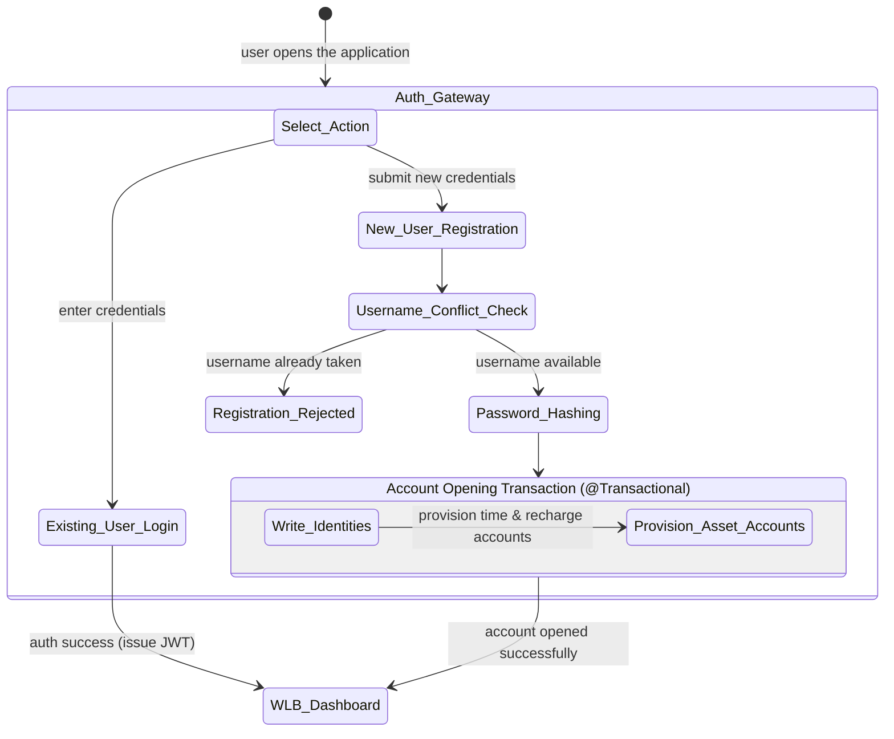
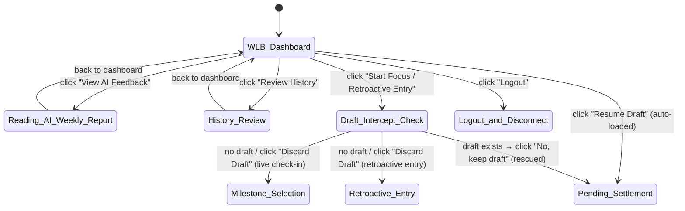
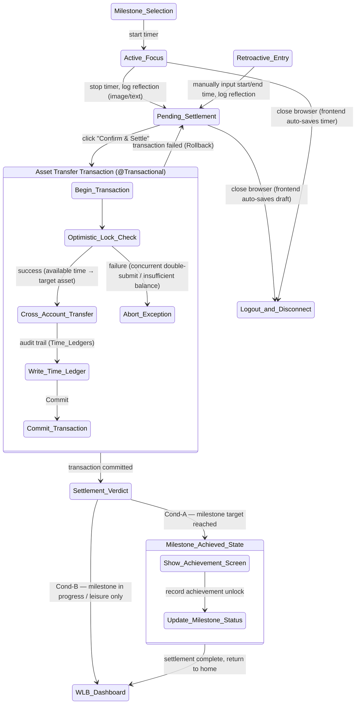
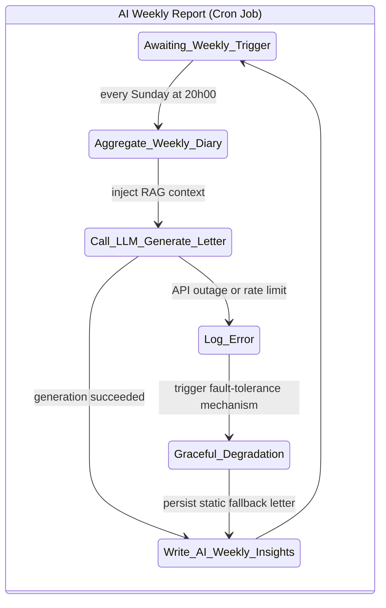

# Project Chronicle — State Flow Diagrams

> A WLB (Work-Life Balance) double-entry ledger engine built on Java Spring Boot + MySQL.
> The following diagrams cover all four core state modules of the system.

---

## Module 1 · Onboarding (Authentication & Account Opening)

---

## Module 2 · WLB Dashboard

---

## Module 3 · Asset Calculation & Settlement

---

## Module 4 · AI Weekly Report

