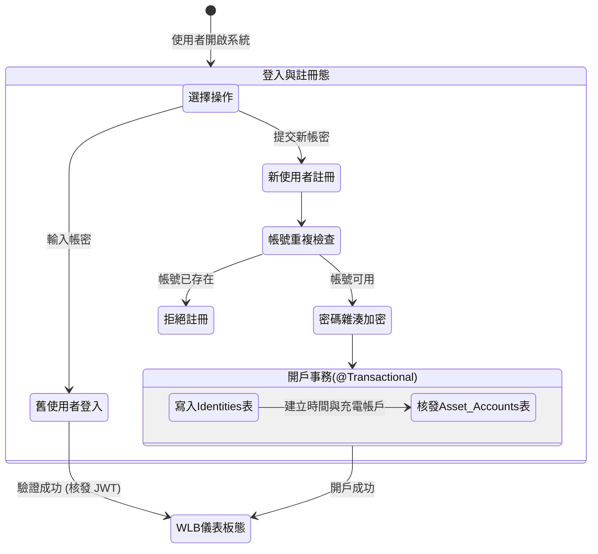
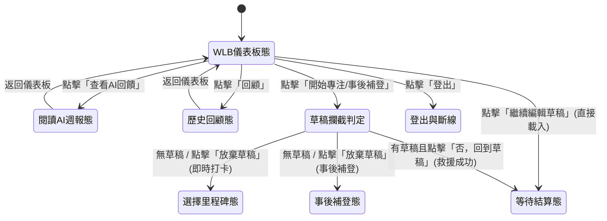
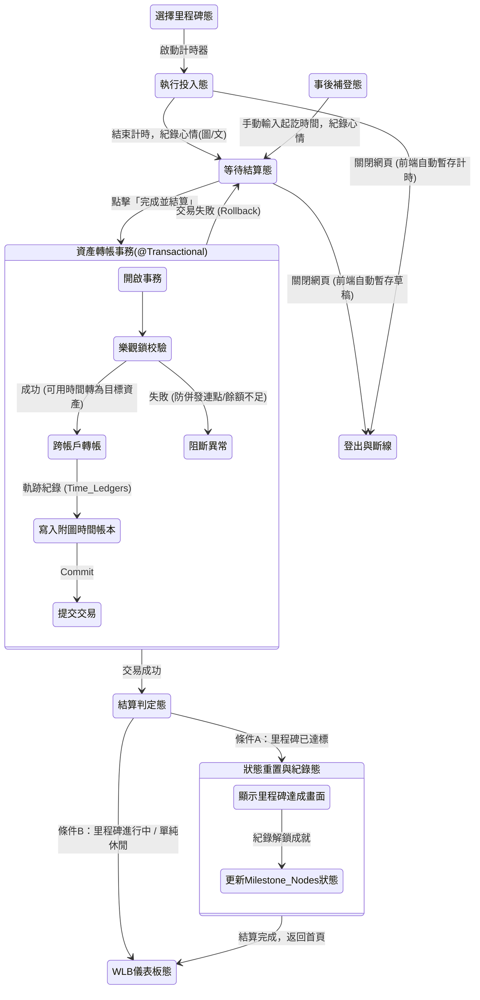
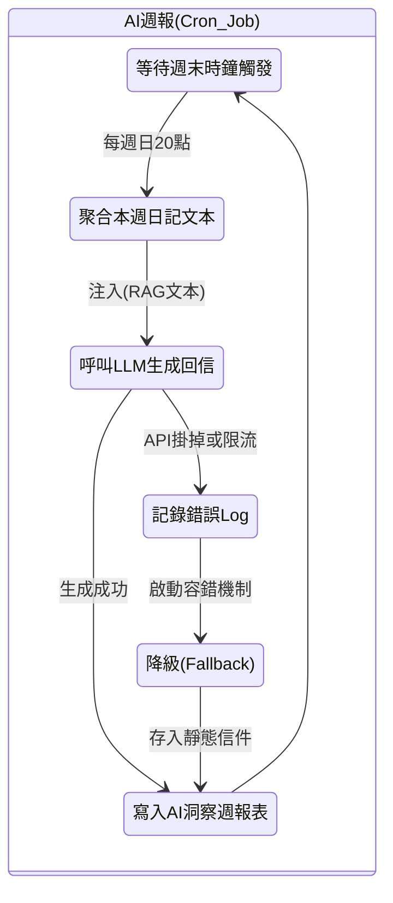

# 編年史計畫 — 狀態流程圖

> 基於 Java Spring Boot + MySQL 的 WLB 雙式記帳引擎。
> 以下涵蓋系統四大核心狀態模組的流程圖。

---

## 模組一 · 登入與註冊 (開戶事務)

```mermaid
stateDiagram-v2
    direction TB
    [*] --> 登入與註冊態 : 使用者開啟系統
    
    state 登入與註冊態 {
        direction TB
        選擇操作 --> 舊使用者登入 : 輸入帳密
        選擇操作 --> 新使用者註冊 : 提交新帳密
        新使用者註冊 --> 帳號重複檢查
        帳號重複檢查 --> 拒絕註冊 : 帳號已存在
        帳號重複檢查 --> 密碼雜湊加密 : 帳號可用
        密碼雜湊加密 --> 開戶事務
        
        state "開戶事務(@Transactional)" as 開戶事務 {
            direction LR
            寫入Identities表 --> 核發Asset_Accounts表 : 建立時間與充電帳戶
        }
    }
    
    舊使用者登入 --> WLB儀表板態 : 驗證成功 (核發 JWT)
    開戶事務 --> WLB儀表板態 : 開戶成功
```

---

## 模組二 · WLB 儀表板

```mermaid
stateDiagram-v2
    direction TB
    [*] --> WLB儀表板態
    
    WLB儀表板態 --> 閱讀AI週報態 : 點擊「查看AI回饋」
    閱讀AI週報態 --> WLB儀表板態 : 返回儀表板
    WLB儀表板態 --> 歷史回顧態 : 點擊「回顧」
    歷史回顧態 --> WLB儀表板態 : 返回儀表板
    
    WLB儀表板態 --> 草稿攔截判定 : 點擊「開始專注/事後補登」
    WLB儀表板態 --> 等待結算態 : 點擊「繼續編輯草稿」(直接載入)
    WLB儀表板態 --> 登出與斷線 : 點擊「登出」
    
    state 草稿攔截判定 <<choice>>
    草稿攔截判定 --> 選擇里程碑態 : 無草稿 / 點擊「放棄草稿」(即時打卡)
    草稿攔截判定 --> 事後補登態 : 無草稿 / 點擊「放棄草稿」(事後補登)
    草稿攔截判定 --> 等待結算態 : 有草稿且點擊「否，回到草稿」(救援成功)
```

---

## 模組三 · 資產結算

```mermaid
stateDiagram-v2
    direction TB
    選擇里程碑態 --> 執行投入態 : 啟動計時器
    執行投入態 --> 等待結算態 : 結束計時，紀錄心情(圖/文)
    事後補登態 --> 等待結算態 : 手動輸入起訖時間，紀錄心情
    
    等待結算態 --> 資產轉帳事務 : 點擊「完成並結算」
    等待結算態 --> 登出與斷線 : 關閉網頁 (前端自動暫存草稿)
    執行投入態 --> 登出與斷線 : 關閉網頁 (前端自動暫存計時)
    
    state "資產轉帳事務(@Transactional)" as 資產轉帳事務 {
        direction TB
        開啟事務 --> 樂觀鎖校驗
        樂觀鎖校驗 --> 跨帳戶轉帳 : 成功 (可用時間轉為目標資產)
        跨帳戶轉帳 --> 寫入附圖時間帳本 : 軌跡紀錄 (Time_Ledgers)
        寫入附圖時間帳本 --> 提交交易 : Commit
        樂觀鎖校驗 --> 阻斷異常 : 失敗 (防併發連點/餘額不足)
    }
    
    資產轉帳事務 --> 結算判定態 : 交易成功
    資產轉帳事務 --> 等待結算態 : 交易失敗 (Rollback)
    
    結算判定態 --> 狀態重置與紀錄態 : 條件A：里程碑已達標
    結算判定態 --> WLB儀表板態 : 條件B：里程碑進行中 / 單純休閒
    
    state 狀態重置與紀錄態 {
        direction TB
        顯示里程碑達成畫面 --> 更新Milestone_Nodes狀態 : 紀錄解鎖成就
    }
    狀態重置與紀錄態 --> WLB儀表板態 : 結算完成，返回首頁
```

---

## 模組四 · AI 週報

```mermaid
stateDiagram-v2
    direction TB
    state "AI週報(Cron_Job)" as AI_Cron_Job {
        direction TB
        等待週末時鐘觸發 --> 聚合本週日記文本 : 每週日20點
        聚合本週日記文本 --> 呼叫LLM生成回信 : 注入(RAG文本)

        state 呼叫LLM生成回信 <<fork>>
        呼叫LLM生成回信 --> 寫入AI洞察週報表 : 生成成功
        呼叫LLM生成回信 --> 記錄錯誤Log : API掛掉或限流

        記錄錯誤Log --> 降級(Fallback) : 啟動容錯機制
        降級(Fallback) --> 寫入AI洞察週報表 : 存入靜態信件
        寫入AI洞察週報表 --> 等待週末時鐘觸發
    }
```
