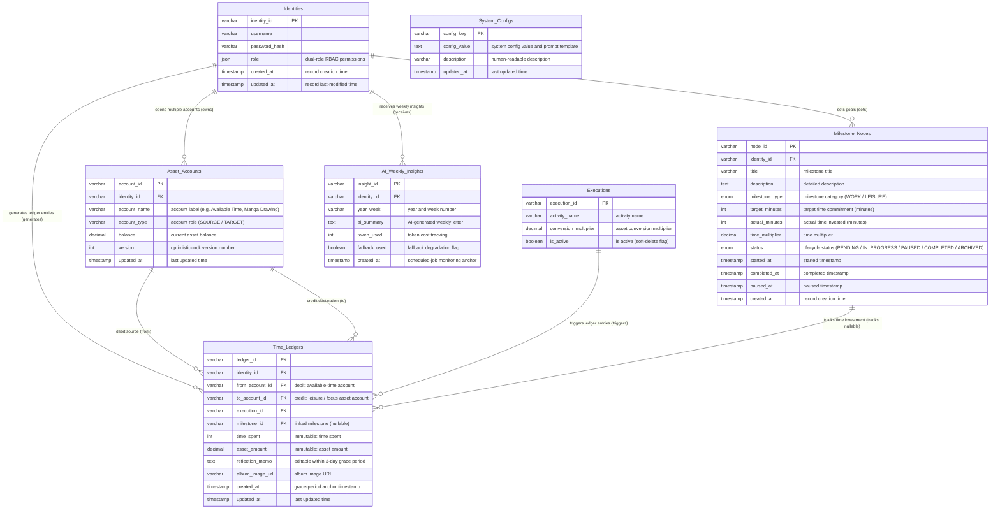

# Database Schema

> This schema translates the system's internal vault design into a strict relational structure conforming to Third Normal Form (3NF).  
> It serves as the single source of truth for all data persistence in the WLB Double-Entry Ledger Engine.

---

## Entity Relationship Diagram

---

## Design Rationale

### RBAC Single-Account Dual-Role (`role`)

Abandons the novice pattern of separate User/Admin tables. Permissions are stored as a JSON array, enabling clean JWT integration and dynamic frontend route-level access control.

### Unlimited Scalable Double-Entry Ledger (`Asset_Accounts` + `Time_Ledgers`)

The core financial engine. Instead of hardcoding a balance field, a 1-to-N account architecture allows users to dynamically open dedicated accounts (e.g. "Manga Drawing Account", "DB Study Account"). `Time_Ledgers` strictly records `from_account_id` (debit party) and `to_account_id` (credit party), implementing true **Double-Entry Bookkeeping**.

### Partial Immutability with Grace Period (`Time_Ledgers`)

Field-level access control: `time_spent` and `asset_amount` are permanently locked once committed. The `reflection_memo` and `album_image_url` fields are granted a 3-day edit window for UX flexibility without compromising financial integrity.

### System Resilience Flag (`fallback_used`)

The boolean flag in `AI_Weekly_Insights` provides an observable record of system health. Even when the LLM API is unavailable, the table faithfully records whether a graceful degradation fallback was triggered.

### Hot-Reloadable Global Configuration (`System_Configs`)

AI prompt templates and business logic variables are extracted from the codebase into this table, enabling zero-downtime hot updates and defending against future scope creep.

### Third Normal Form (3NF) Compliance

`Time_Ledgers` references `execution_id` via Foreign Key instead of duplicating the activity name string. This eliminates Update Anomalies and satisfies strict normalization requirements.

---

## DDL Reference

See: `../src/main/resources/schema.sql`
